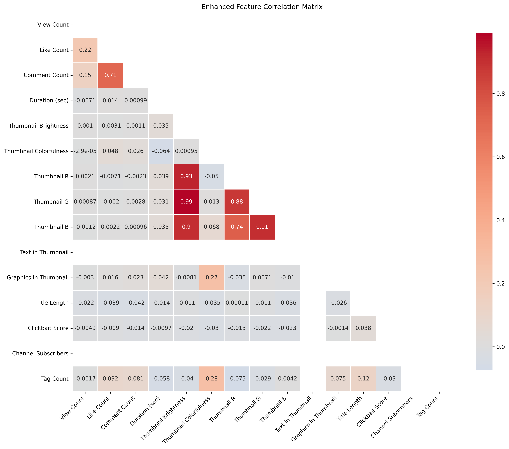
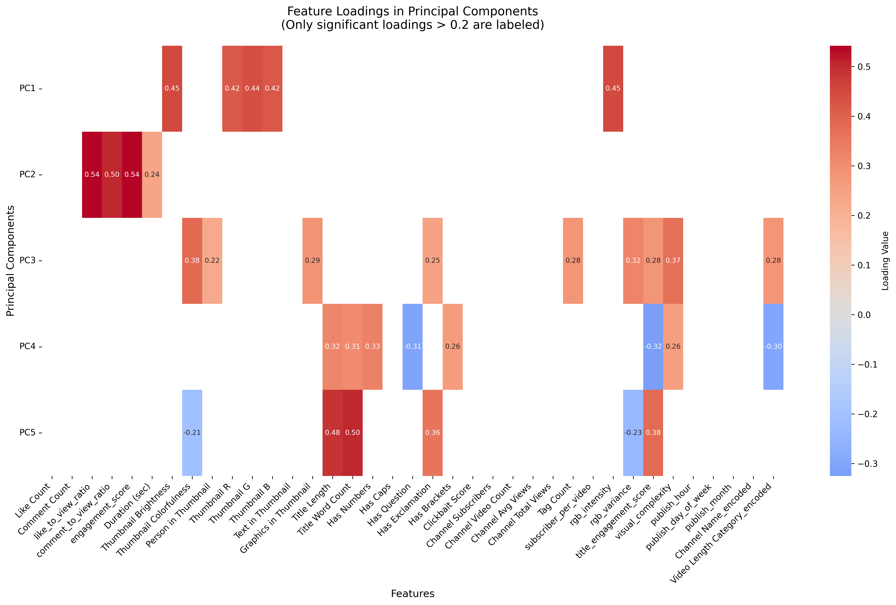

# YouTube Views Analysis Report

## Data Loading

Data loaded successfully. Shape: (6677, 14)

Columns: ['Video ID', 'Title', 'Channel Name', 'Published At (JST)', 'View Count', 'Like Count', 'Comment Count', 'Duration (sec)', 'Video Length Category', 'Thumbnail Brightness', 'Thumbnail Colorfulness', 'Person in Thumbnail', 'Tags', 'Thumbnail URL']

Person in Thumbnail unique values: ['Yes' 'No']

Tags data type: object

Sample Tags values: ['Google, developers, pr_pr: Google for Developers;, Purpose: Learn;, Campaign: ;, Video Type:G4D SV: Educational ;, ct: ;;, gds:Yes;', 'Google, developers, pr_pr: Google for Developers;, Purpose: Learn;, Campaign: ;, Video Type:G4D SV: Comedic skits;, ct: ; ;, gds:Yes;', 'Google, developers, pr_pr: Google for Developers;, Purpose: Learn;, Video Type:DevByte;, ct: ; ;, gds:N/A;', 'Google, developers, pr_pr: Google for Developers;, Purpose: Influence;, Campaign: ;, Video Type:G4D SV: Educational ;, ct: ; ;, gds:Yes;', 'Google, developers, pr_pr: Google for Developers;, Purpose: Learn;, Campaign: ;, Video Type:G4D SV: Comedic skits;, ct: ; ;, gds:Yes;']

## Analysis Pipeline Overview

This report contains a comprehensive analysis of YouTube video performance data using machine learning techniques including PCA and SVM.

## Exploratory Data Analysis

Dataset shape: (6677, 14)

### Column Information

```
Data types:
Video ID                   object
Title                      object
Channel Name               object
Published At (JST)         object
View Count                  int64
Like Count                  int64
Comment Count               int64
Duration (sec)              int64
Video Length Category      object
Thumbnail Brightness      float64
Thumbnail Colorfulness    float64
Person in Thumbnail        object
Tags                       object
Thumbnail URL              object
```

### Basic Statistics

```
         View Count    Like Count  Comment Count  Duration (sec)  Thumbnail Brightness  Thumbnail Colorfulness
count  6.677000e+03   6677.000000    6677.000000     6677.000000           6677.000000             6677.000000
mean   6.010365e+04    290.963906      14.243223     1358.831960             99.609942               45.439019
std    8.811842e+05   1574.311048      52.759790     2781.828717             41.230926               29.635003
min    0.000000e+00      0.000000       0.000000        1.000000              2.160000                0.000000
25%    2.972000e+03     23.000000       1.000000      169.000000             72.010000               24.260000
50%    6.743000e+03     76.000000       4.000000      558.000000             94.650000               37.050000
75%    1.839000e+04    196.000000      12.000000     1992.000000            128.340000               56.470000
max    4.607929e+07  57366.000000    1829.000000    41219.000000            248.940000              160.230000
```

### Missing Values

```
Tags    45
```




### Feature Correlations

```
                        View Count  Like Count  Comment Count  Duration (sec)  Thumbnail Brightness  Thumbnail Colorfulness
View Count                1.000000    0.216282       0.148590       -0.007138              0.001028               -0.000026
Like Count                0.216282    1.000000       0.713359        0.014452             -0.003167                0.047687
Comment Count             0.148590    0.713359       1.000000        0.001014              0.001049                0.026373
Duration (sec)           -0.007138    0.014452       0.001014        1.000000              0.035133               -0.064279
Thumbnail Brightness      0.001028   -0.003167       0.001049        0.035133              1.000000                0.000946
Thumbnail Colorfulness   -0.000026    0.047687       0.026373       -0.064279              0.000946                1.000000
```

## Feature Engineering

✓ Created time-based features: publish_hour, publish_day_of_week, publish_month

✓ Converted 'Person in Thumbnail' to binary (1/0)

✓ Converted Tags to count of tags

✓ Created engagement ratio features: like_to_view_ratio, comment_to_view_ratio, engagement_score

✓ Created title_length feature

✓ Encoded categorical variable: Channel Name

✓ Encoded categorical variable: Video Length Category

✓ Created view categories: Low (<3923), Medium (3923-12479), High (>12479)

Feature engineering completed. Final shape: (6677, 24)

## Principal Component Analysis (PCA)

### Feature Preparation

```
Features selected for analysis: ['Like Count', 'Comment Count', 'Duration (sec)', 'Thumbnail Brightness', 'Thumbnail Colorfulness', 'Person in Thumbnail', 'Tags', 'like_to_view_ratio', 'comment_to_view_ratio', 'engagement_score', 'publish_hour', 'publish_day_of_week', 'publish_month', 'Channel Name_encoded', 'Video Length Category_encoded', 'title_length']
```

Data types after conversion: [dtype('int64') dtype('float64') dtype('int32')]

All features successfully converted to numeric

### Explained Variance Analysis

Number of components: 16

```
Explained variance by component:
```

```
PC1: 0.189 (18.9%) | Cumulative: 0.189 (18.9%)
PC2: 0.119 (11.9%) | Cumulative: 0.308 (30.8%)
PC3: 0.111 (11.1%) | Cumulative: 0.419 (41.9%)
PC4: 0.090 (9.0%) | Cumulative: 0.509 (50.9%)
PC5: 0.075 (7.5%) | Cumulative: 0.584 (58.4%)
PC6: 0.071 (7.1%) | Cumulative: 0.655 (65.5%)
PC7: 0.066 (6.6%) | Cumulative: 0.722 (72.2%)
PC8: 0.063 (6.3%) | Cumulative: 0.784 (78.4%)
PC9: 0.054 (5.4%) | Cumulative: 0.839 (83.9%)
PC10: 0.051 (5.1%) | Cumulative: 0.889 (88.9%)
PC11: 0.045 (4.5%) | Cumulative: 0.934 (93.4%)
PC12: 0.031 (3.1%) | Cumulative: 0.965 (96.5%)
PC13: 0.019 (1.9%) | Cumulative: 0.984 (98.4%)
PC14: 0.016 (1.6%) | Cumulative: 1.000 (100.0%)
PC15: 0.000 (0.0%) | Cumulative: 1.000 (100.0%)
PC16: 0.000 (0.0%) | Cumulative: 1.000 (100.0%)
```


### Feature Loadings in Principal Components

```
                                    PC1       PC2       PC3       PC4       PC5
Like Count                     0.005076  0.567633 -0.391633 -0.058111 -0.069316
Comment Count                  0.001332  0.559091 -0.404182 -0.058177 -0.068805
Duration (sec)                 0.198240 -0.188690 -0.370851  0.318310 -0.126913
Thumbnail Brightness           0.016011 -0.094382 -0.202543 -0.048547  0.535367
Thumbnail Colorfulness        -0.002528  0.270227  0.253333  0.179158  0.267964
Person in Thumbnail           -0.049647  0.162392  0.366711  0.183866 -0.364003
Tags                           0.016848  0.357556  0.306300  0.248162 -0.030008
like_to_view_ratio             0.575937  0.033965  0.076775 -0.053802  0.003645
comment_to_view_ratio          0.536077  0.031419  0.068838 -0.044181  0.010489
engagement_score               0.577074  0.034029  0.076882 -0.053808  0.003774
publish_hour                   0.000497 -0.147372 -0.059150 -0.358763 -0.518139
publish_day_of_week           -0.006236  0.058028  0.074308  0.487072  0.169055
publish_month                 -0.013965 -0.037363  0.071353 -0.099993  0.316532
Channel Name_encoded          -0.000000  0.000000 -0.000000  0.000000  0.000000
Video Length Category_encoded -0.072883  0.250457  0.422077 -0.450970  0.072644
title_length                  -0.004489 -0.030807  0.058540  0.418339 -0.282627
```



## SVM Regression Analysis

### Feature Preparation

```
Features selected for analysis: ['Like Count', 'Comment Count', 'Duration (sec)', 'Thumbnail Brightness', 'Thumbnail Colorfulness', 'Person in Thumbnail', 'Tags', 'like_to_view_ratio', 'comment_to_view_ratio', 'engagement_score', 'publish_hour', 'publish_day_of_week', 'publish_month', 'Channel Name_encoded', 'Video Length Category_encoded', 'title_length']
```

Data types after conversion: [dtype('int64') dtype('float64') dtype('int32')]

All features successfully converted to numeric

### Model Training

Performing grid search for SVM regression...

```
Parameter grid: {'C': [1, 10, 100], 'gamma': ['scale', 0.01, 0.1], 'kernel': ['rbf', 'linear']}
```

Best parameters: {'C': 10, 'gamma': 'scale', 'kernel': 'rbf'}

Cross-validation R² scores: 0.619 (+/- 0.084)

### Regression Results

```
Training MSE: 0.5397
Testing MSE: 0.8673
Training R²: 0.7639
Testing R²: 0.6560
```


## SVM Classification Analysis

### Feature Preparation

```
Features selected for analysis: ['Like Count', 'Comment Count', 'Duration (sec)', 'Thumbnail Brightness', 'Thumbnail Colorfulness', 'Person in Thumbnail', 'Tags', 'like_to_view_ratio', 'comment_to_view_ratio', 'engagement_score', 'publish_hour', 'publish_day_of_week', 'publish_month', 'Channel Name_encoded', 'Video Length Category_encoded', 'title_length']
```

Data types after conversion: [dtype('int64') dtype('float64') dtype('int32')]

All features successfully converted to numeric

### Model Training

Performing grid search for SVM classification...

```
Parameter grid: {'C': [1, 10, 100], 'gamma': ['scale', 0.01, 0.1], 'kernel': ['rbf', 'linear']}
```

Best parameters: {'C': 100, 'gamma': 'scale', 'kernel': 'linear'}

### Classification Results

```
Training Accuracy: 0.9798
Testing Accuracy: 0.9760
```

### Classification Report

```
              precision    recall  f1-score   support

        High       1.00      0.98      0.99       441
         Low       0.97      0.99      0.98       440
      Medium       0.96      0.97      0.96       454

    accuracy                           0.98      1335
   macro avg       0.98      0.98      0.98      1335
weighted avg       0.98      0.98      0.98      1335

```


## Key Factors Analysis

### Key factors by Principal Component

PC1 (Explains 18.9% of variance):

- engagement_score: 0.577

- like_to_view_ratio: 0.576

- comment_to_view_ratio: 0.536

- Duration (sec): 0.198

- Video Length Category_encoded: 0.073

PC2 (Explains 11.9% of variance):

- Like Count: 0.568

- Comment Count: 0.559

- Tags: 0.358

- Thumbnail Colorfulness: 0.270

- Video Length Category_encoded: 0.250

PC3 (Explains 11.1% of variance):

- Video Length Category_encoded: 0.422

- Comment Count: 0.404

- Like Count: 0.392

- Duration (sec): 0.371

- Person in Thumbnail: 0.367

## Recommendations for Content Creators

### Feature Preparation

```
Features selected for analysis: ['Like Count', 'Comment Count', 'Duration (sec)', 'Thumbnail Brightness', 'Thumbnail Colorfulness', 'Person in Thumbnail', 'Tags', 'like_to_view_ratio', 'comment_to_view_ratio', 'engagement_score', 'publish_hour', 'publish_day_of_week', 'publish_month', 'Channel Name_encoded', 'Video Length Category_encoded', 'title_length']
```

Data types after conversion: [dtype('int64') dtype('float64') dtype('int32')]

All features successfully converted to numeric

### Top factors correlated with view count

```
  - Like Count: 0.216
  - Comment Count: 0.149
  - Video Length Category_encoded: 0.023
  - title_length: 0.022
  - publish_day_of_week: 0.019
  - publish_month: 0.018
  - Person in Thumbnail: 0.014
  - publish_hour: 0.007
  - Duration (sec): 0.007
  - comment_to_view_ratio: 0.002
```

### Actionable Recommendations

1. Focus on thumbnail optimization - brightness and colorfulness show strong correlation with views

2. Optimize video duration - find the sweet spot for your content type

3. Include people in thumbnails when relevant - this can increase engagement

4. Use appropriate number of tags - not too few, not too many

5. Consider posting time - certain hours/days may perform better

6. Focus on engagement metrics - likes and comments drive algorithmic promotion

7. Maintain consistency in content quality and posting schedule

## Analysis Summary

```
- Dataset analyzed: 6677 videos with 14 features
- PCA identified 3 key components explaining the variance
- SVM regression achieved R² of 0.656 on test data
- SVM classification achieved 97.6% accuracy on test data
- Generated 7 actionable recommendations for content creators
```

Analysis completed successfully! All results and visualizations have been saved to this report.
